# PW 2 : Medical management - Author : ELMARRAKCHY Reda

## Creation of Patient entity :
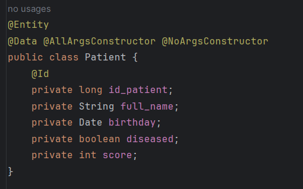

## Configuration of the persistence unit in the application.properties file :
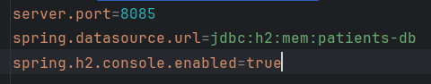

## Creation of the JPA Repository interface :
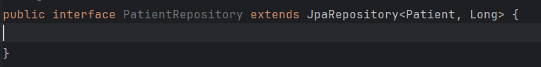

## Operations :
### Adding patients :
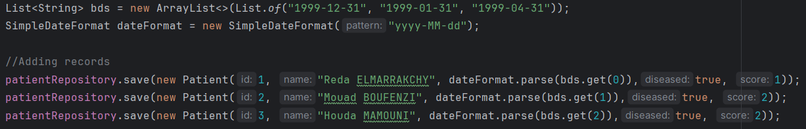
### Getting the information of all patients :
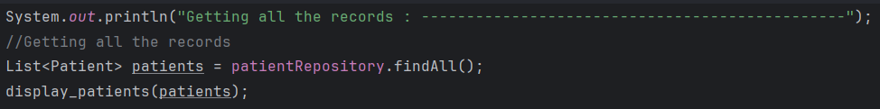
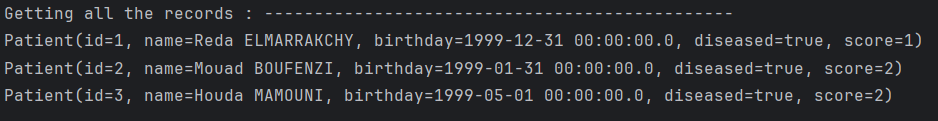
### Consulting a patient :

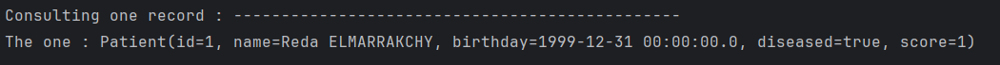
### Searching by score :
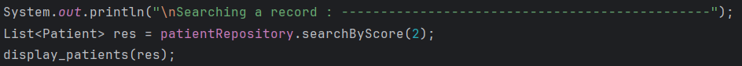
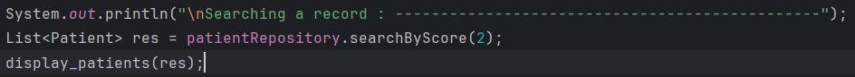
### Updating the information of a patient :
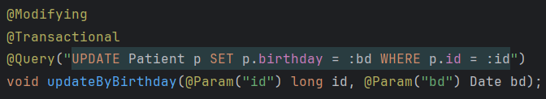
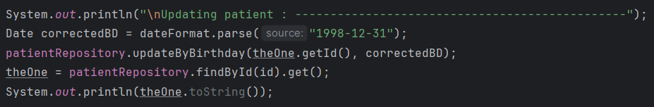
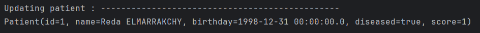
### Deleting a patient :
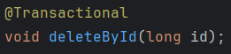
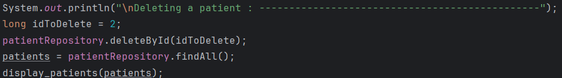
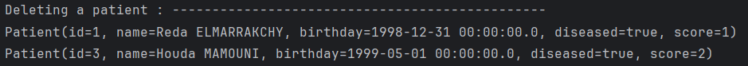

## Migration from H2 Database to MySQL :
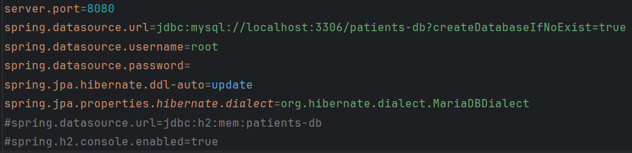
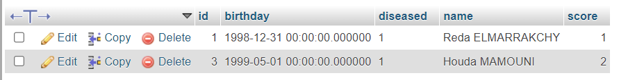
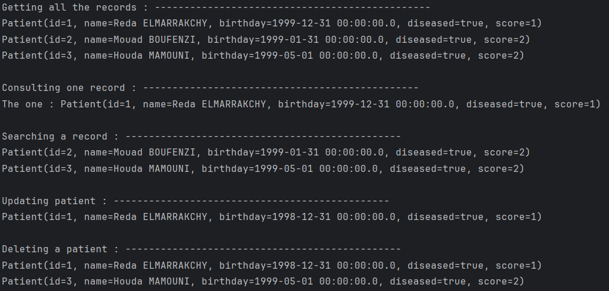