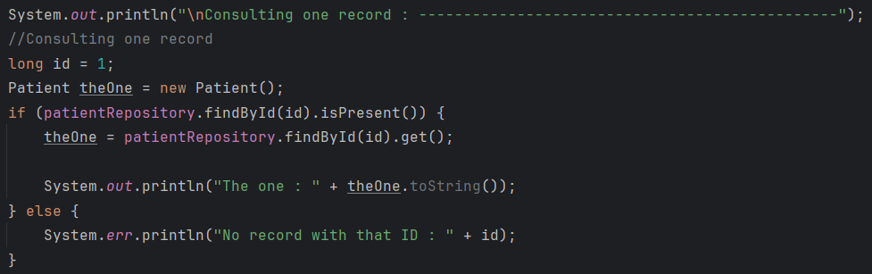

# PW 2 : Medical management - Author : ELMARRAKCHY Reda

## Creation of Patient entity :

## Configuration of the persistence unit in the application.properties file :

## Creation of the JPA Repository interface :

## Operations :
### Adding patients :

### Getting the information of all patients :

### Consulting a patient :

### Searching by score :

### Updating the information of a patient :

### Deleting a patient :

## Migration from H2 Database to MySQL :

